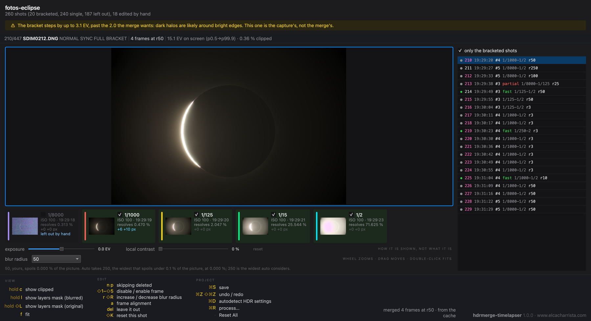
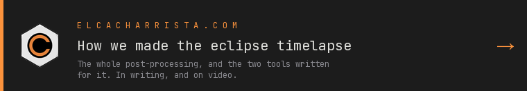

# hdrmerge-timelapser

Turns the bracketed bursts of a timelapse into a merged sequence, ready for
DaVinci Resolve. It orchestrates [HDRMerge](https://github.com/jcelaya/hdrmerge)
by Javier Celaya, which is what does the merging; what this adds is
understanding the timelapse as a whole — where one bracket ends and the next
begins, which exposures are worth merging, how far to feather the layer mask —
and letting you see and correct all of it before spending an hour of compute.

Scene-linear EXR by default, or DNG or TIFF.



## Getting it

There is a macOS app and a Windows installer on the
[releases page](https://github.com/jahurtado/hdrmerge-timelapser/releases). Both
carry their own Python **and their own HDRMerge**, so there is nothing to
install beside them.

Neither is signed with a paid developer certificate, so the first launch is
blocked once and you allow it on purpose: on macOS through System Settings →
Privacy & Security, on Windows by clicking past the SmartScreen warning. Each
download carries a note saying so.

## From source

You need [uv](https://docs.astral.sh/uv/), and HDRMerge on the machine — the
bundles carry their own, a clone does not.

```sh
git clone https://github.com/jahurtado/hdrmerge-timelapser.git
cd hdrmerge-timelapser
uv sync --extra gui
uv run hdrmerge-timelapser
```

With no arguments it opens the window, which is how it is meant to be used.

More detail, including where HDRMerge is looked for, is in
[docs/installation.md](docs/installation.md); building the desktop bundles
yourself is in [packaging/README.md](packaging/README.md).

## How it works

Measuring is slow and fallible, merging is slow and irreversible, and a person
belongs between the two. The first pass writes no pixels: it reads the EXIF of
every raw and writes a document with **the measurement beside each decision**,
so the window can explain rather than assert — and anything you correct by hand
survives measuring again.

[](https://www.elcacharrista.com/en/articles/solar-eclipse-2026-timelapse/)

## Licence

GPL-3.0-or-later; the full text is in [LICENSE](LICENSE). It is the same licence
as HDRMerge, which the macOS app and the Windows build carry inside them. What
else travels in there, and where its source is, is in
[THIRD-PARTY-LICENSES.md](THIRD-PARTY-LICENSES.md).

Its sibling is [`eclipse-aligner`](https://github.com/jahurtado/eclipse-aligner),
which aligns the frames this one merges.
